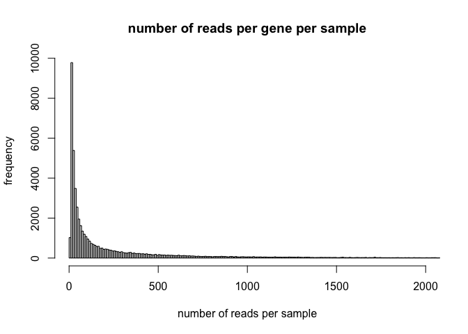
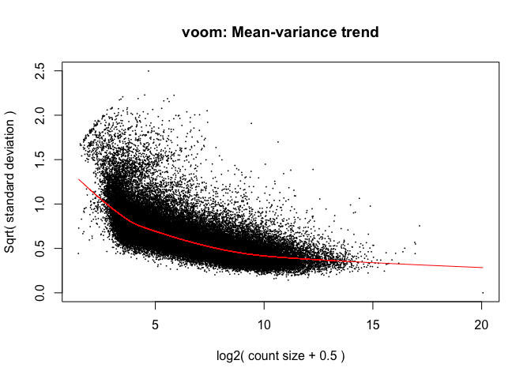
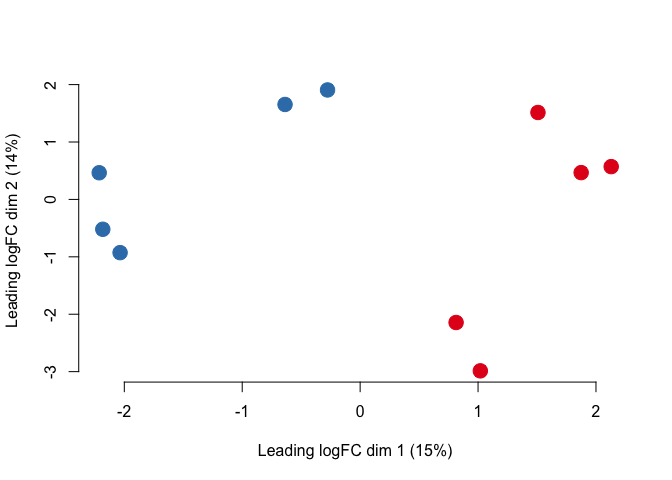
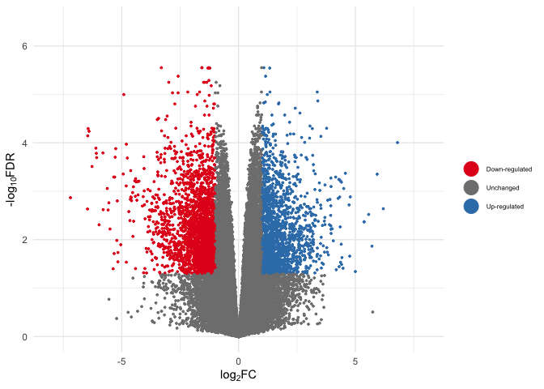

DE_analysis_L.Rmd
================
2025-12-23

Once gene counts have been obtained and summarised within the
RSEM_gene_counts file, differential expression analyses can be performed
on the data. For this the R Studio software is utilised. ***Please
note***, this code is repeated for each individual tissue and species
combination, used to compare expression between temperature treatments.
**This example is for the brain tissue of the common triplefin**.

# Loading necessary libraries

``` r
library(tidyr)
library(DESeq2)
```

    ## Loading required package: S4Vectors

    ## Loading required package: stats4

    ## Loading required package: BiocGenerics

    ## Loading required package: generics

    ## 
    ## Attaching package: 'generics'

    ## The following objects are masked from 'package:base':
    ## 
    ##     as.difftime, as.factor, as.ordered, intersect, is.element, setdiff,
    ##     setequal, union

    ## 
    ## Attaching package: 'BiocGenerics'

    ## The following objects are masked from 'package:stats':
    ## 
    ##     IQR, mad, sd, var, xtabs

    ## The following objects are masked from 'package:base':
    ## 
    ##     anyDuplicated, aperm, append, as.data.frame, basename, cbind,
    ##     colnames, dirname, do.call, duplicated, eval, evalq, Filter, Find,
    ##     get, grep, grepl, is.unsorted, lapply, Map, mapply, match, mget,
    ##     order, paste, pmax, pmax.int, pmin, pmin.int, Position, rank,
    ##     rbind, Reduce, rownames, sapply, saveRDS, table, tapply, unique,
    ##     unsplit, which.max, which.min

    ## 
    ## Attaching package: 'S4Vectors'

    ## The following object is masked from 'package:tidyr':
    ## 
    ##     expand

    ## The following object is masked from 'package:utils':
    ## 
    ##     findMatches

    ## The following objects are masked from 'package:base':
    ## 
    ##     expand.grid, I, unname

    ## Loading required package: IRanges

    ## Loading required package: GenomicRanges

    ## Loading required package: Seqinfo

    ## Loading required package: SummarizedExperiment

    ## Loading required package: MatrixGenerics

    ## Loading required package: matrixStats

    ## 
    ## Attaching package: 'MatrixGenerics'

    ## The following objects are masked from 'package:matrixStats':
    ## 
    ##     colAlls, colAnyNAs, colAnys, colAvgsPerRowSet, colCollapse,
    ##     colCounts, colCummaxs, colCummins, colCumprods, colCumsums,
    ##     colDiffs, colIQRDiffs, colIQRs, colLogSumExps, colMadDiffs,
    ##     colMads, colMaxs, colMeans2, colMedians, colMins, colOrderStats,
    ##     colProds, colQuantiles, colRanges, colRanks, colSdDiffs, colSds,
    ##     colSums2, colTabulates, colVarDiffs, colVars, colWeightedMads,
    ##     colWeightedMeans, colWeightedMedians, colWeightedSds,
    ##     colWeightedVars, rowAlls, rowAnyNAs, rowAnys, rowAvgsPerColSet,
    ##     rowCollapse, rowCounts, rowCummaxs, rowCummins, rowCumprods,
    ##     rowCumsums, rowDiffs, rowIQRDiffs, rowIQRs, rowLogSumExps,
    ##     rowMadDiffs, rowMads, rowMaxs, rowMeans2, rowMedians, rowMins,
    ##     rowOrderStats, rowProds, rowQuantiles, rowRanges, rowRanks,
    ##     rowSdDiffs, rowSds, rowSums2, rowTabulates, rowVarDiffs, rowVars,
    ##     rowWeightedMads, rowWeightedMeans, rowWeightedMedians,
    ##     rowWeightedSds, rowWeightedVars

    ## Loading required package: Biobase

    ## Welcome to Bioconductor
    ## 
    ##     Vignettes contain introductory material; view with
    ##     'browseVignettes()'. To cite Bioconductor, see
    ##     'citation("Biobase")', and for packages 'citation("pkgname")'.

    ## 
    ## Attaching package: 'Biobase'

    ## The following object is masked from 'package:MatrixGenerics':
    ## 
    ##     rowMedians

    ## The following objects are masked from 'package:matrixStats':
    ## 
    ##     anyMissing, rowMedians

``` r
library(pheatmap)
library(stringr)
library(ggplot2)
library(dplyr)
```

    ## 
    ## Attaching package: 'dplyr'

    ## The following object is masked from 'package:Biobase':
    ## 
    ##     combine

    ## The following object is masked from 'package:matrixStats':
    ## 
    ##     count

    ## The following objects are masked from 'package:GenomicRanges':
    ## 
    ##     intersect, setdiff, union

    ## The following object is masked from 'package:Seqinfo':
    ## 
    ##     intersect

    ## The following objects are masked from 'package:IRanges':
    ## 
    ##     collapse, desc, intersect, setdiff, slice, union

    ## The following objects are masked from 'package:S4Vectors':
    ## 
    ##     first, intersect, rename, setdiff, setequal, union

    ## The following objects are masked from 'package:BiocGenerics':
    ## 
    ##     combine, intersect, setdiff, setequal, union

    ## The following object is masked from 'package:generics':
    ## 
    ##     explain

    ## The following objects are masked from 'package:stats':
    ## 
    ##     filter, lag

    ## The following objects are masked from 'package:base':
    ## 
    ##     intersect, setdiff, setequal, union

``` r
library(matrixStats)
library(edgeR)
```

    ## Loading required package: limma

    ## 
    ## Attaching package: 'limma'

    ## The following object is masked from 'package:DESeq2':
    ## 
    ##     plotMA

    ## The following object is masked from 'package:BiocGenerics':
    ## 
    ##     plotMA

``` r
library(grid)
library("RColorBrewer")
library(ggrepel)
```

# Loading and subsetting the count data

The raw RSEM gene count data can be accessed here
[RSEM_gene_counts.txt](https://github.com/breanariordan/triplefinRNA/blob/main/RSEM_gene_counts.txt)

``` r
# changing column names
original=read.csv("RSEM_gene_counts_L.txt", sep="", head=T)
head(original)
```

    ##                        X10L1brain X10L1heart X10L2brain X10L2heart X10L3brain
    ## TRINITY_DN0_c0_g1          834.44    5537.55     749.46    4959.63     739.30
    ## TRINITY_DN0_c0_g2          777.82     162.43     677.62     114.64     777.04
    ## TRINITY_DN0_c0_g3           72.40    1388.32      74.54    1359.18      50.70
    ## TRINITY_DN100000_c0_g1       0.00      26.00       0.00       5.00       0.00
    ## TRINITY_DN100001_c0_g1       0.00       0.00       0.00       0.00       0.00
    ## TRINITY_DN100002_c0_g1       0.00       2.00       1.00       1.00       0.00
    ##                        X10L3heart X10L4brain X10L4heart X10L5brain X10L5heart
    ## TRINITY_DN0_c0_g1         5443.98     706.76    3931.99     780.83    4528.54
    ## TRINITY_DN0_c0_g2          206.28     576.95     114.44     708.41     126.89
    ## TRINITY_DN0_c0_g3         1476.85      97.91     875.01      98.17    1241.40
    ## TRINITY_DN100000_c0_g1       1.00       1.00       1.00       1.00       6.00
    ## TRINITY_DN100001_c0_g1       0.00       0.00       0.00       0.00       0.00
    ## TRINITY_DN100002_c0_g1       0.00       0.00       0.00       0.00       1.00
    ##                        X10N1brain X10N1heart X10N2brain X10N2heart X10N3brain
    ## TRINITY_DN0_c0_g1          861.51    3293.61     633.42    4236.99     833.73
    ## TRINITY_DN0_c0_g2          832.27     226.14     631.86     166.09     723.39
    ## TRINITY_DN0_c0_g3          101.49     660.39      64.39    1065.95      65.98
    ## TRINITY_DN100000_c0_g1       0.00       0.00       0.00       0.00       0.00
    ## TRINITY_DN100001_c0_g1       1.00       0.00       0.00       0.00       0.00
    ## TRINITY_DN100002_c0_g1       0.00       1.00       1.00       0.00       4.00
    ##                        X10N3heart X10N4brain X10N4heart X10N5brain X10N5heart
    ## TRINITY_DN0_c0_g1         4654.50     684.31    2886.41     728.86    2816.71
    ## TRINITY_DN0_c0_g2          165.99     463.08      82.73     510.80      90.95
    ## TRINITY_DN0_c0_g3         1011.50      42.58     376.37      62.07     357.29
    ## TRINITY_DN100000_c0_g1       0.00       0.00       0.00       0.00       0.00
    ## TRINITY_DN100001_c0_g1       0.00       0.00       0.00       0.00       0.00
    ## TRINITY_DN100002_c0_g1       1.00       1.00       1.00       3.00       0.00
    ##                        X22L1brain X22L1heart X22L2brain X22L2heart X22L3brain
    ## TRINITY_DN0_c0_g1         1232.84    2137.74     907.34    3177.38     953.58
    ## TRINITY_DN0_c0_g2          387.13      61.38     385.43      41.34     525.08
    ## TRINITY_DN0_c0_g3          163.87     493.21     113.65     852.60     110.29
    ## TRINITY_DN100000_c0_g1       0.00       0.00       0.00       0.00       0.00
    ## TRINITY_DN100001_c0_g1       0.00       0.00       1.00       0.00       0.00
    ## TRINITY_DN100002_c0_g1       0.00       0.00       0.00       0.00       0.00
    ##                        X22L3heart X22L4brain X22L4heart X22L5brain X22L5heart
    ## TRINITY_DN0_c0_g1         3755.63    1190.23    2124.36    1025.87    2566.12
    ## TRINITY_DN0_c0_g2           76.76     685.44      75.75     398.30     103.08
    ## TRINITY_DN0_c0_g3         1078.37     108.69     550.59     117.01     621.86
    ## TRINITY_DN100000_c0_g1       0.00       1.00       0.00       0.00       0.00
    ## TRINITY_DN100001_c0_g1       0.00       1.00       0.00       0.00       0.00
    ## TRINITY_DN100002_c0_g1       2.00       3.00       1.00       2.00       4.00
    ##                        X22N1brain X22N1heart X22N2brain X22N2heart X22N3brain
    ## TRINITY_DN0_c0_g1         1322.79    2783.94    1187.63    2763.24     967.48
    ## TRINITY_DN0_c0_g2          680.11     107.58     479.15      75.78     561.77
    ## TRINITY_DN0_c0_g3          138.04     714.95     106.16     612.76      83.36
    ## TRINITY_DN100000_c0_g1       0.00       0.00       0.00       4.00       0.00
    ## TRINITY_DN100001_c0_g1       1.00       0.00       0.00       0.00       0.00
    ## TRINITY_DN100002_c0_g1       1.00       0.00       0.00       0.00       1.00
    ##                        X22N3heart X22N4brain X22N4heart X22N5brain X22N5heart
    ## TRINITY_DN0_c0_g1         3561.95     866.50    3439.05    1076.71    2676.32
    ## TRINITY_DN0_c0_g2           76.23     630.36      84.29     638.65     113.64
    ## TRINITY_DN0_c0_g3          887.95     123.81     759.89     113.14     675.68
    ## TRINITY_DN100000_c0_g1       0.00       0.00       0.00       0.00       0.00
    ## TRINITY_DN100001_c0_g1       0.00       1.00       0.00       0.00       0.00
    ## TRINITY_DN100002_c0_g1       0.00       0.00       2.00       0.00       0.00

``` r
#rownames(original)<-original[,1]
#original<-original[,-1]

colnames(original) <- c ("10L1brain", "10L1heart", "10L2brain", "10L2heart", "10L3brain", "10L3heart", "10L4brain", "10L4heart", "10L5brain", "10L5heart", "10N1brain", "10N1heart", "10N2brain", "10N2heart", "10N3brain","10N3heart", "10N4brain", "10N4heart", "10N5brain", "10N5heart", "22L1brain", "22L1heart", "22L2brain", "22L2heart", "22L3brain", "22L3heart", "22L4brain", "22L4heart", "22L5brain", "22L5heart", "22N1brain", "22N1heart", "22N2brain", "22N2heart", "22N3brain", "22N3heart", "22N4brain", "22N4heart", "22N5brain", "22N5heart")

# subsetting data to target specific tissues and species, this will change depending on what you are looking at
subset_datalapillum <- original[, grepl("L", colnames(original))]
subset_datalapillumbrain <- subset_datalapillum[, grepl("brain",colnames(subset_datalapillum))]

# creating temperature variable for comparison
sampleslapbrain <- cbind(colnames(subset_datalapillumbrain), rep(c("10", "22"), each = 5))
rownames(sampleslapbrain) <- sampleslapbrain[,1]
sampleslapbrain <- as.data.frame(sampleslapbrain[, -1])
colnames(sampleslapbrain) <- c("treatment")
sampleslapbrain$treatment <- factor(rep(c("10", "22"), each = 5))
```

# Basic filtering

``` r
des <- model.matrix(~sampleslapbrain$treatment)
dge <- DGEList(counts = subset_datalapillumbrain)
keep <- filterByExpr(subset_datalapillumbrain, des)
dge <- dge[keep, keep.lib.sizes=TRUE]

dge <- calcNormFactors(dge)
dim(dge)
```

    ## [1] 54391    10

# Exploratory analyses and visualisation after filtering

``` r
# checking number of reads per gene
quantile(apply(dge$counts,1,sum)/10,seq(0,1,0.05))
```

    ##           0%           5%          10%          15%          20%          25% 
    ##       6.4000      11.5660      13.9490      16.6510      20.1300      24.6205 
    ##          30%          35%          40%          45%          50%          55% 
    ##      30.3000      38.0000      47.8000      61.6040      80.4000     105.0000 
    ##          60%          65%          70%          75%          80%          85% 
    ##     139.9010     188.2580     254.3880     347.2835     477.8000     676.6130 
    ##          90%          95%         100% 
    ##    1039.6590    1863.2530 1104976.5590

``` r
hist(apply(dge$counts,1,sum)/10, xlim = c(0,2000), breaks = 100000, main = "number of reads per gene per sample", xlab = "number of reads per sample", ylab = "frequency")
```

<!-- -->

``` r
# look at the most expressed genes
which(apply(dge$counts,1,sum)/10>1e5)
```

    ##   TRINITY_DN205_c5_g1 TRINITY_DN24163_c0_g2   TRINITY_DN309_c1_g1 
    ##                 18655                 22707                 28580 
    ##  TRINITY_DN5438_c0_g1  TRINITY_DN8721_c0_g2 
    ##                 40057                 50468

# Performing the DE analysis

``` r
logCPM <- cpm(dge, log=TRUE)
design <- model.matrix(~sampleslapbrain$treatment)

v <- voom(dge, design, plot=TRUE, normalize="quantile")
```

<!-- -->

``` r
# visualising clustering of samples
plotMDS(v, pch = 19, col = rep(c( "#377EB8","#E41A1C"), each = 5), cex = 2, frame = F, main = "", cex.axis = 1)
```

<!-- -->

``` r
#legend(x=-2.3, y=2.4, legend = c("10", "22"), col = c("#377EB8","#E41A1C"), pch = 19, cex = 0.7, title = "Temperature treatment (°C), ")
```

10 is blue, 22 is red

``` r
# over/ underexpressed gene counts

fit <- lmFit(v, design)
fit <- eBayes(fit, trend=TRUE)
results <- topTable(fit, coef=ncol(design),n=Inf)

sum(results$adj.P.Val<0.05)
```

    ## [1] 11512

``` r
DE_results <- results[results$adj.P.Val<0.05,]
DE_counts<-dge[which(rownames(dge)%in%rownames(results)),]$counts

#Also take account logFC

DEdown<-DE_results[which(DE_results$logFC<(-1)),]
DEup<-DE_results[which(DE_results$logFC>(1)),]
DE_results<-rbind(DEdown,DEup)
```

# Creating the figures

``` r
# volcano plot

results <- results %>%  mutate(
  Expression = case_when(logFC >= 1 & adj.P.Val <= 0.05 ~ "Up-regulated",
  logFC <= -1 & adj.P.Val <= 0.05 ~ "Down-regulated",
  TRUE ~ "Unchanged"))

ggvolcano <- ggplot(results, aes(logFC,-log10(adj.P.Val))) +
  geom_point(aes(color = Expression), size = 3/5) +
  scale_color_manual(values = c(  "#E41A1C","gray50","#377EB8")) +
  theme_minimal() + theme(legend.text=element_text(size=6)) +
  xlab(expression("log"[2]*"FC")) + 
  ylim(0,6.5) +
  xlim(-8,8) +
  ylab(expression("-log"[10]*"FDR")) +
  guides(colour = guide_legend(override.aes = list(size=6),legend.key.size=6,title="")) 
```

    ## Warning in guide_legend(override.aes = list(size = 6), legend.key.size = 6, : Arguments in `...` must be used.
    ## ✖ Problematic argument:
    ## • legend.key.size = 6
    ## ℹ Did you misspell an argument name?

``` r
ggvolcano
```

    ## Warning: Removed 1 row containing missing values or values outside the scale range
    ## (`geom_point()`).

<!-- -->

# Creating tables for Gene Ontology analyses

``` r
# Printing DE results

final_results_DE <- merge(DE_results, DE_counts, by=0)
colnames(final_results_DE)[1] <- "GeneID"
write.csv(final_results_DE, "lapbrain_DE_results.csv", row.names = T, col.names = T)
```

    ## Warning in write.csv(final_results_DE, "lapbrain_DE_results.csv", row.names =
    ## T, : attempt to set 'col.names' ignored

``` r
# GO writing

write(rownames(DE_results), "GOlapbrainallDE.txt", sep="n")

write.table(rownames(DE_results) [which(DE_results$logFC>0)], "GOlapbrain_upregulated.txt", row.names=F, col.names=F, quote=F)
write.table(rownames(DE_results) [which(DE_results$logFC<0)], "GOlapbrain_downregulated.txt", row.names=F, col.names=F, quote=F)

write(rownames(dge$counts), "GOlapbrain_background.txt", sep="\n")
write(rownames(dge$counts)[-which(rownames(dge$counts)%in%rownames(DE_results))], "GOla-brain_background_no_overlap.txt", sep="n")

final_results<-merge(results, dge$counts, by=0)
colnames(final_results)[1]<-"GeneID"
write.table(final_results, "lapbrain_ALLgenes_results.txt", row.names=T, col.names=T, sep="\t")
```
