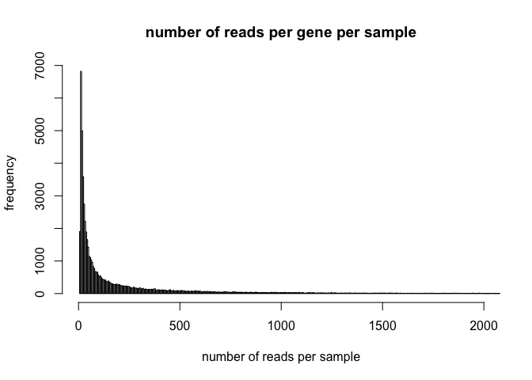
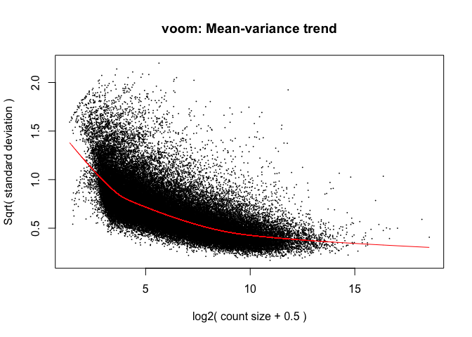
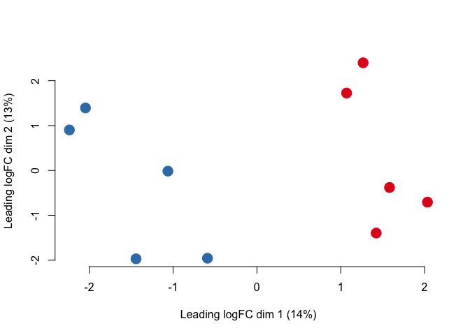
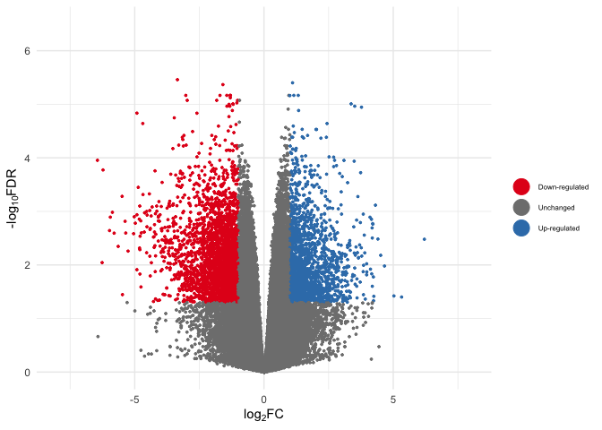

DE_analysis.Rmd
================
2025-12-23

Once gene counts have been obtained and summarised within the
RSEM_gene_counts file, differential expression analyses can be performed
on the data. For this the R Studio software is utilised. ***Please
note***, this code is repeated for each individual tissue and species
combination, used to compare expression between temperature treatments.
**This example is for the brain tissue of the common triplefin**.

# Loading necessary libraries

``` r
library(tidyr)
library(DESeq2)
```

    ## Loading required package: S4Vectors

    ## Loading required package: stats4

    ## Loading required package: BiocGenerics

    ## Loading required package: generics

    ## 
    ## Attaching package: 'generics'

    ## The following objects are masked from 'package:base':
    ## 
    ##     as.difftime, as.factor, as.ordered, intersect, is.element, setdiff,
    ##     setequal, union

    ## 
    ## Attaching package: 'BiocGenerics'

    ## The following objects are masked from 'package:stats':
    ## 
    ##     IQR, mad, sd, var, xtabs

    ## The following objects are masked from 'package:base':
    ## 
    ##     anyDuplicated, aperm, append, as.data.frame, basename, cbind,
    ##     colnames, dirname, do.call, duplicated, eval, evalq, Filter, Find,
    ##     get, grep, grepl, is.unsorted, lapply, Map, mapply, match, mget,
    ##     order, paste, pmax, pmax.int, pmin, pmin.int, Position, rank,
    ##     rbind, Reduce, rownames, sapply, saveRDS, table, tapply, unique,
    ##     unsplit, which.max, which.min

    ## 
    ## Attaching package: 'S4Vectors'

    ## The following object is masked from 'package:tidyr':
    ## 
    ##     expand

    ## The following object is masked from 'package:utils':
    ## 
    ##     findMatches

    ## The following objects are masked from 'package:base':
    ## 
    ##     expand.grid, I, unname

    ## Loading required package: IRanges

    ## Loading required package: GenomicRanges

    ## Loading required package: Seqinfo

    ## Loading required package: SummarizedExperiment

    ## Loading required package: MatrixGenerics

    ## Loading required package: matrixStats

    ## 
    ## Attaching package: 'MatrixGenerics'

    ## The following objects are masked from 'package:matrixStats':
    ## 
    ##     colAlls, colAnyNAs, colAnys, colAvgsPerRowSet, colCollapse,
    ##     colCounts, colCummaxs, colCummins, colCumprods, colCumsums,
    ##     colDiffs, colIQRDiffs, colIQRs, colLogSumExps, colMadDiffs,
    ##     colMads, colMaxs, colMeans2, colMedians, colMins, colOrderStats,
    ##     colProds, colQuantiles, colRanges, colRanks, colSdDiffs, colSds,
    ##     colSums2, colTabulates, colVarDiffs, colVars, colWeightedMads,
    ##     colWeightedMeans, colWeightedMedians, colWeightedSds,
    ##     colWeightedVars, rowAlls, rowAnyNAs, rowAnys, rowAvgsPerColSet,
    ##     rowCollapse, rowCounts, rowCummaxs, rowCummins, rowCumprods,
    ##     rowCumsums, rowDiffs, rowIQRDiffs, rowIQRs, rowLogSumExps,
    ##     rowMadDiffs, rowMads, rowMaxs, rowMeans2, rowMedians, rowMins,
    ##     rowOrderStats, rowProds, rowQuantiles, rowRanges, rowRanks,
    ##     rowSdDiffs, rowSds, rowSums2, rowTabulates, rowVarDiffs, rowVars,
    ##     rowWeightedMads, rowWeightedMeans, rowWeightedMedians,
    ##     rowWeightedSds, rowWeightedVars

    ## Loading required package: Biobase

    ## Welcome to Bioconductor
    ## 
    ##     Vignettes contain introductory material; view with
    ##     'browseVignettes()'. To cite Bioconductor, see
    ##     'citation("Biobase")', and for packages 'citation("pkgname")'.

    ## 
    ## Attaching package: 'Biobase'

    ## The following object is masked from 'package:MatrixGenerics':
    ## 
    ##     rowMedians

    ## The following objects are masked from 'package:matrixStats':
    ## 
    ##     anyMissing, rowMedians

``` r
library(pheatmap)
library(stringr)
library(ggplot2)
library(dplyr)
```

    ## 
    ## Attaching package: 'dplyr'

    ## The following object is masked from 'package:Biobase':
    ## 
    ##     combine

    ## The following object is masked from 'package:matrixStats':
    ## 
    ##     count

    ## The following objects are masked from 'package:GenomicRanges':
    ## 
    ##     intersect, setdiff, union

    ## The following object is masked from 'package:Seqinfo':
    ## 
    ##     intersect

    ## The following objects are masked from 'package:IRanges':
    ## 
    ##     collapse, desc, intersect, setdiff, slice, union

    ## The following objects are masked from 'package:S4Vectors':
    ## 
    ##     first, intersect, rename, setdiff, setequal, union

    ## The following objects are masked from 'package:BiocGenerics':
    ## 
    ##     combine, intersect, setdiff, setequal, union

    ## The following object is masked from 'package:generics':
    ## 
    ##     explain

    ## The following objects are masked from 'package:stats':
    ## 
    ##     filter, lag

    ## The following objects are masked from 'package:base':
    ## 
    ##     intersect, setdiff, setequal, union

``` r
library(matrixStats)
library(edgeR)
```

    ## Loading required package: limma

    ## 
    ## Attaching package: 'limma'

    ## The following object is masked from 'package:DESeq2':
    ## 
    ##     plotMA

    ## The following object is masked from 'package:BiocGenerics':
    ## 
    ##     plotMA

``` r
library(grid)
library("RColorBrewer")
library(ggrepel)
```

# Loading and subsetting the count data

The raw RSEM gene count data can be accessed here
[RSEM_gene_counts.txt](https://github.com/breanariordan/triplefinRNA/blob/main/RSEM_gene_counts.txt)

``` r
# changing column names
original=read.csv("RSEM_gene_counts.txt", sep="", head=T)
head(original)
```

    ##        TranscriptID X10L1brain X10L1heart X10L2brain X10L2heart X10L3brain
    ## 1 TRINITY_DN0_c0_g1      85.08      92.68      23.02     289.17      82.42
    ## 2 TRINITY_DN0_c0_g2     126.63     250.98      41.67     337.41      97.94
    ## 3 TRINITY_DN0_c0_g3      50.05      53.00      29.00     183.32     133.13
    ## 4 TRINITY_DN0_c1_g1     102.89     498.65      49.00     795.60     239.41
    ## 5 TRINITY_DN0_c1_g2       3.78       9.42       3.00       4.84       2.39
    ## 6 TRINITY_DN0_c2_g1     403.88     739.75     144.00     816.07     223.00
    ##   X10L3heart X10L4brain X10L4heart X10L5brain X10L5heart X10N1brain X10N1heart
    ## 1     379.41      42.01     246.92      69.97     373.62      45.57      77.18
    ## 2     345.35     103.14     365.07     136.96     343.83     803.60    1085.98
    ## 3     265.33     115.99     281.67     132.18     256.02     232.02     170.28
    ## 4    1206.31     181.10    1095.26     266.42    1113.32     370.02    1230.16
    ## 5       8.03      10.43       9.57       2.82      13.59      70.19      58.57
    ## 6    1449.88     340.80    1062.21     248.17    1118.57     330.78    1249.86
    ##   X10N2brain X10N2heart X10N3brain X10N3heart X10N4brain X10N4heart X10N5brain
    ## 1      15.05      44.87      47.68     107.98      27.91     213.04      92.35
    ## 2     336.23     621.86     483.69     778.42     506.83     753.77     543.73
    ## 3     150.64     217.31     193.64     198.39     153.04     158.86     122.31
    ## 4     159.73     988.79     156.01     902.52     160.39    1252.95     198.94
    ## 5      39.56      64.31      47.42      43.04      18.67      47.32      22.79
    ## 6     383.84    1474.00     283.67    1115.60     331.00    1724.08     378.00
    ##   X10N5heart X22L1brain X22L1heart X22L2brain X22L2heart X22L3brain X22L3heart
    ## 1     812.17      70.90     521.05      86.88     413.50      50.49     417.14
    ## 2     898.29     134.52     260.54      94.65     239.62     119.14     269.98
    ## 3     179.48     305.74     257.80     152.10      83.11     144.10     232.34
    ## 4    1417.81     206.86     932.93     352.80     436.80     229.86     851.85
    ## 5      58.18      19.88      24.17       5.91       4.29      10.71      15.27
    ## 6    2302.31     323.42    1389.82     358.74    1266.91     354.23    1734.53
    ##   X22L4brain X22L4heart X22L5brain X22L5heart X22N1brain X22N1heart X22N2brain
    ## 1     108.91     732.30     130.21     470.42     149.06     587.01      36.32
    ## 2     111.00     166.45      80.10     219.59     323.82     517.89     263.43
    ## 3     120.24     267.29     276.39     186.98     222.36     224.51     130.86
    ## 4     243.88     630.47     140.91     712.77     224.97    1036.05     290.09
    ## 5      10.88      18.63      10.16       6.13      71.04      81.50      50.10
    ## 6     357.77    1324.54     321.64    1413.68     381.04    2025.79     311.90
    ##   X22N2heart X22N3brain X22N3heart X22N4brain X22N4heart X22N5brain X22N5heart
    ## 1     206.30      85.68     275.46      82.25     209.45     131.50     426.03
    ## 2     385.36     252.29     489.16     322.62     511.02     268.94     464.03
    ## 3     107.57     176.78     143.28     117.00     168.59     153.23     211.95
    ## 4    1447.73     196.71     782.53     441.62    1358.11     453.26    1330.37
    ## 5      50.52      59.13      60.70      30.66      52.32      57.76      91.20
    ## 6    1496.48     442.51    1319.11     291.43    1222.17     328.01    1717.69

``` r
rownames(original)<-original[,1]
original<-original[,-1]

colnames(original) <- c ("10L1brain", "10L1heart", "10L2brain", "10L2heart", "10L3brain", "10L3heart", "10L4brain", "10L4heart", "10L5brain", "10L5heart", "10N1brain", "10N1heart", "10N2brain", "10N2heart", "10N3brain","10N3heart", "10N4brain", "10N4heart", "10N5brain", "10N5heart", "22L1brain", "22L1heart", "22L2brain", "22L2heart", "22L3brain", "22L3heart", "22L4brain", "22L4heart", "22L5brain", "22L5heart", "22N1brain", "22N1heart", "22N2brain", "22N2heart", "22N3brain", "22N3heart", "22N4brain", "22N4heart", "22N5brain", "22N5heart")

# subsetting data to target specific tissues and species, this will change depending on what you are looking at
subset_datalapillum <- original[, grepl("L", colnames(original))]
subset_datalapillumbrain <- subset_datalapillum[, grepl("brain",colnames(subset_datalapillum))]

# creating temperature variable for comparison
sampleslapbrain <- cbind(colnames(subset_datalapillumbrain), rep(c("10", "22"), each = 5))
rownames(sampleslapbrain) <- sampleslapbrain[,1]
sampleslapbrain <- as.data.frame(sampleslapbrain[, -1])
colnames(sampleslapbrain) <- c("treatment")
sampleslapbrain$treatment <- factor(rep(c("10", "22"), each = 5))
```

# Basic filtering

``` r
des <- model.matrix(~sampleslapbrain$treatment)
dge <- DGEList(counts = subset_datalapillumbrain)
keep <- filterByExpr(subset_datalapillumbrain, des)
dge <- dge[keep, keep.lib.sizes=TRUE]

dge <- calcNormFactors(dge)
dim(dge)
```

    ## [1] 61748    10

# Exploratory analyses and visualisation after filtering

``` r
# checking number of reads per gene
quantile(apply(dge$counts,1,sum)/10,seq(0,1,0.05))
```

    ##           0%           5%          10%          15%          20%          25% 
    ##      5.73200     10.83435     13.04270     15.47820     18.50000     22.20000 
    ##          30%          35%          40%          45%          50%          55% 
    ##     27.12560     33.47345     41.48780     52.22730     66.71400     86.36240 
    ##          60%          65%          70%          75%          80%          85% 
    ##    113.00440    151.10330    203.57840    275.11125    382.82860    551.31930 
    ##          90%          95%         100% 
    ##    852.13690   1560.55100 419617.67200

``` r
hist(apply(dge$counts,1,sum)/10, xlim = c(0,2000), breaks = 100000, main = "number of reads per gene per sample", xlab = "number of reads per sample", ylab = "frequency")
```

<!-- -->

``` r
# look at the most expressed genes
which(apply(dge$counts,1,sum)/10>1e5)
```

    ## TRINITY_DN1100_c0_g1 TRINITY_DN2141_c0_g2 TRINITY_DN224_c14_g1 
    ##                 2631                21762                23107 
    ## TRINITY_DN3350_c1_g1  TRINITY_DN340_c0_g1  TRINITY_DN340_c1_g2 
    ##                34764                35201                35209

# Performing the DE analysis

``` r
logCPM <- cpm(dge, log=TRUE)
design <- model.matrix(~sampleslapbrain$treatment)

v <- voom(dge, design, plot=TRUE, normalize="quantile")
```

<!-- -->

``` r
# visualising clustering of samples
plotMDS(v, pch = 19, col = rep(c( "#377EB8","#E41A1C"), each = 5), cex = 2, frame = F, main = "", cex.axis = 1)
```

<!-- -->

``` r
#legend(x=-2.3, y=2.4, legend = c("10", "22"), col = c("#377EB8","#E41A1C"), pch = 19, cex = 0.7, title = "Temperature treatment (°C), ")
```

10 is blue, 22 is red

``` r
# over/ underexpressed gene counts

fit <- lmFit(v, design)
fit <- eBayes(fit, trend=TRUE)
results <- topTable(fit, coef=ncol(design),n=Inf)

sum(results$adj.P.Val<0.05)
```

    ## [1] 10699

``` r
DE_results <- results[results$adj.P.Val<0.05,]
DE_counts<-dge[which(rownames(dge)%in%rownames(results)),]$counts

#Also take account logFC

DEdown<-DE_results[which(DE_results$logFC<(-1)),]
DEup<-DE_results[which(DE_results$logFC>(1)),]
DE_results<-rbind(DEdown,DEup)
```

# Creating the figures

``` r
# volcano plot

results <- results %>%  mutate(
  Expression = case_when(logFC >= 1 & adj.P.Val <= 0.05 ~ "Up-regulated",
  logFC <= -1 & adj.P.Val <= 0.05 ~ "Down-regulated",
  TRUE ~ "Unchanged"))

ggvolcano <- ggplot(results, aes(logFC,-log10(adj.P.Val))) +
  geom_point(aes(color = Expression), size = 3/5) +
  scale_color_manual(values = c(  "#E41A1C","gray50","#377EB8")) +
  theme_minimal() + theme(legend.text=element_text(size=6)) +
  xlab(expression("log"[2]*"FC")) + 
  ylim(0,6.5) +
  xlim(-8,8) +
  ylab(expression("-log"[10]*"FDR")) +
  guides(colour = guide_legend(override.aes = list(size=6),legend.key.size=6,title="")) 
```

    ## Warning in guide_legend(override.aes = list(size = 6), legend.key.size = 6, : Arguments in `...` must be used.
    ## ✖ Problematic argument:
    ## • legend.key.size = 6
    ## ℹ Did you misspell an argument name?

``` r
ggvolcano
```

    ## Warning: Removed 1 row containing missing values or values outside the scale range
    ## (`geom_point()`).

<!-- -->

# Creating tables for Gene Ontology analyses

``` r
# Printing DE results

final_results_DE <- merge(DE_results, DE_counts, by=0)
colnames(final_results_DE)[1] <- "GeneID"
write.csv(final_results_DE, "lapbrain_DE_results.csv", row.names = T, col.names = T)
```

    ## Warning in write.csv(final_results_DE, "lapbrain_DE_results.csv", row.names =
    ## T, : attempt to set 'col.names' ignored

``` r
# GO writing

write(rownames(DE_results), "GOlapbrainallDE.txt", sep="n")

write.table(rownames(DE_results) [which(DE_results$logFC>0)], "GOlapbrain_upregulated.txt", row.names=F, col.names=F, quote=F)
write.table(rownames(DE_results) [which(DE_results$logFC<0)], "GOlapbrain_downregulated.txt", row.names=F, col.names=F, quote=F)

write(rownames(dge$counts), "GOlapbrain_background.txt", sep="\n")
write(rownames(dge$counts)[-which(rownames(dge$counts)%in%rownames(DE_results))], "GOla-brain_background_no_overlap.txt", sep="n")

final_results<-merge(results, dge$counts, by=0)
colnames(final_results)[1]<-"GeneID"
write.table(final_results, "lapbrain_ALLgenes_results.txt", row.names=T, col.names=T, sep="\t")
```
